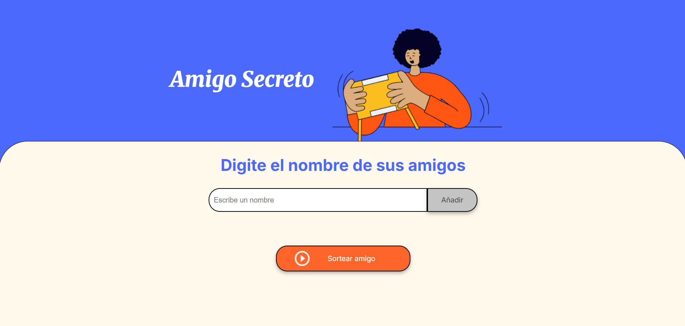
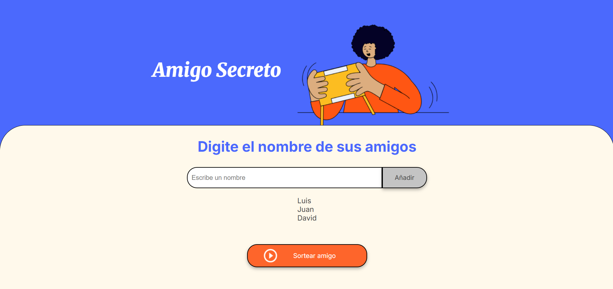
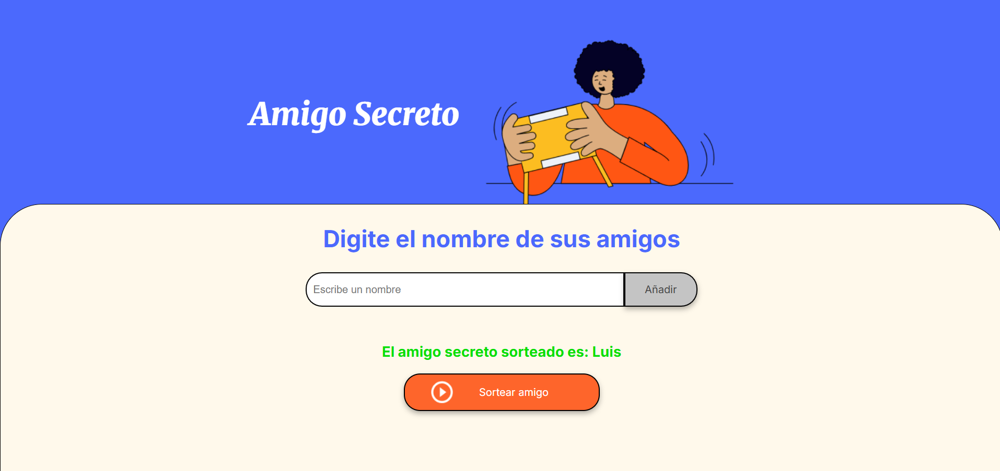

# 🎁 Amigo Secreto - Desafío de Lógica de Programación

¡Bienvenido! Este proyecto es un **desafío de programación en JavaScript** enfocado en fortalecer tus habilidades en **lógica, arrays y manipulación del DOM**. Permite agregar amigos a una lista y sortear un amigo secreto de manera aleatoria.

---

## 🛠 Tecnologías

- **JavaScript (ES6)**
- **HTML** para la estructura de la página
- **DOM Manipulation** para actualizar la lista de amigos y mostrar resultados

---

## ✨ Funcionalidades

### 1️⃣ Agregar amigos
- Captura el nombre desde el input.
- Valida que el campo no esté vacío.
- Añade el nombre al array `amigos` y actualiza la lista visual en el `<ul>`.

### 2️⃣ Actualizar la lista
- Limpia la lista existente y la reconstruye con los amigos añadidos.

### 3️⃣ Limpiar el campo de entrada
- Vacía automáticamente el input después de agregar un amigo.

### 4️⃣ Sortear amigo secreto
- Verifica que haya al menos un amigo en la lista.
- Selecciona un amigo aleatorio.
- Muestra el resultado en pantalla y limpia la lista visual.

---

## 💡 Ejemplo de uso

Sigue estos pasos para jugar:

1. **Abrir el proyecto**  
   Abre el archivo `index.html` en tu navegador.

2. **Añadir amigos**  
   - Escribe un nombre en el campo **“Añadir amigo”**.  
   - Presiona el botón **Agregar**.  
   - Verás cómo el nombre se agrega a la lista debajo del input.  
   - Repite este paso hasta agregar todos los participantes.

3. **Sorteo del amigo secreto**  
   - Cuando la lista tenga al menos 2 amigos, presiona el botón **Sortear amigo**.  
   - Se mostrará en pantalla el nombre del amigo secreto elegido al azar.  
   - La lista de amigos se limpia automáticamente para mostrar solo el resultado.

**Ejemplo práctico:**

- Lista de amigos agregados: `["Luis", "Juan", "David"]`  
- Resultado del sorteo: `El amigo secreto sorteado es: Luis`

---

## 📌 Notas

- Este proyecto está diseñado para **practicar lógica de programación y manipulación de arrays**.
- Ideal para **principiantes en JavaScript** que quieren mejorar sus habilidades en funciones, condicionales y bucles.

---

## 🏷 Autor

**David Alejandro Acosta Peña**

---

